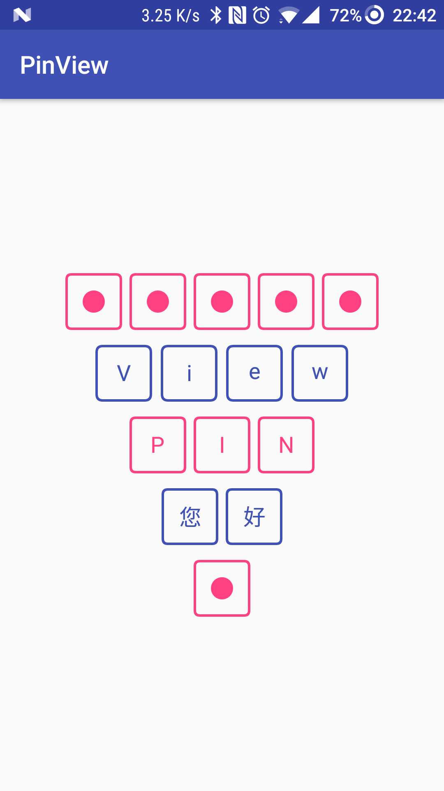
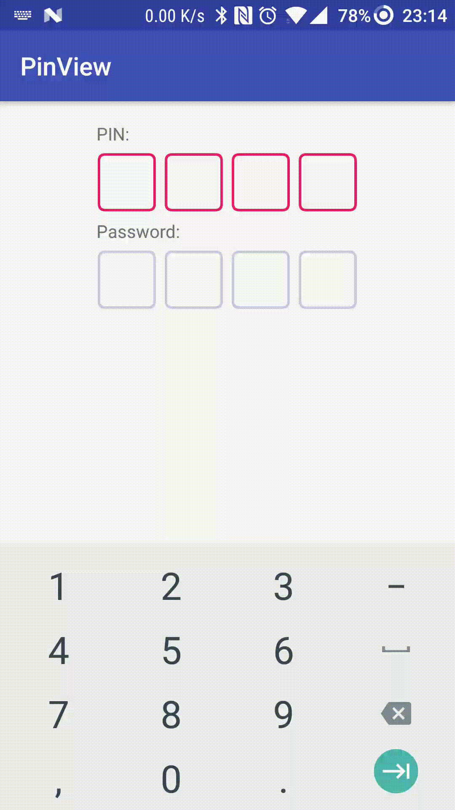

# PinView

Provides a widget for enter PIN/OTP/password etc.

<p>
</p>

## Dependency

``` Groovy
repositories {
    maven {
        jcenter()
    }
}

dependencies {
   compile 'com.chaos.view:pinview:1.0.1'
}
```

## Usage

### Step 1:

Add PinView in your layout.

#### XML

``` xml
<com.chaos.view.PinView
    android:id="@+id/pinView"
    android:layout_width="wrap_content"
    android:layout_height="wrap_content"
    android:inputType="number"
    android:padding="5dp"
    android:text="12345"
    android:textColor="@color/text_colors"
    android:textSize="18sp"
    app:borderColor="@color/border_colors"
    app:borderWidth="2dp"
    app:boxCount="5"
    app:boxHeight="48dp"
    app:boxMargin="4dp"
    app:boxRadius="4dp"
    style="@style/PinWidget.PinView" />
```

#### Java

``` Java
PinView pinView = (PinView) findViewById(R.id.secondPinView);
pinView.setTextColor(
        ResourcesCompat.getColor(getResources(), R.color.colorAccent, getTheme()));
pinView.setTextColor(
        ResourcesCompat.getColorStateList(getResources(), R.color.text_colors, getTheme()));
pinView.setBorderColor(
        ResourcesCompat.getColor(getResources(), R.color.colorPrimary, getTheme()));
pinView.setBorderColor(
        ResourcesCompat.getColorStateList(getResources(), R.color.border_colors, getTheme()));
pinView.setBoxCount(5);
pinView.setBoxHeight(getResources().getDimensionPixelSize(R.dimen.pv_pin_view_box_height));
pinView.setBoxRadius(getResources().getDimensionPixelSize(R.dimen.pv_pin_view_box_radius));
pinView.setBoxMargin(getResources().getDimensionPixelSize(R.dimen.pv_pin_view_box_margin));
pinView.setBorderWidth(getResources().getDimensionPixelSize(R.dimen.pv_pin_view_box_border_width));
pinView.setAnimationEnable(true);// start animation when adding text
```

### Step 2:

Specifies `pinViewStyle` in your theme,

``` xml
<style name="AppTheme" parent="Theme.AppCompat.Light">
    ...
    <item name="pinViewStyle">@style/PinWidget.PinView</item>
</style>
```

or implement `PinWidget.PinView` style.

``` xml
<com.chaos.view.PinView
    android:id="@+id/pinView"
    android:layout_width="wrap_content"
    android:layout_height="wrap_content"
    style="@style/PinWidget.PinView" />
```

## Thanks

 * Inspired by [PasswordInput](https://github.com/EthanCo/PasswordInput) in [EthanCo](https://github.com/EthanCo)

## License


    Copyright 2017 Chaos Leong

    Licensed under the Apache License, Version 2.0 (the "License");
    you may not use this file except in compliance with the License.
    You may obtain a copy of the License at

        http://www.apache.org/licenses/LICENSE-2.0

    Unless required by applicable law or agreed to in writing, software
    distributed under the License is distributed on an "AS IS" BASIS,
    WITHOUT WARRANTIES OR CONDITIONS OF ANY KIND, either express or implied.
    See the License for the specific language governing permissions and
    limitations under the License.


